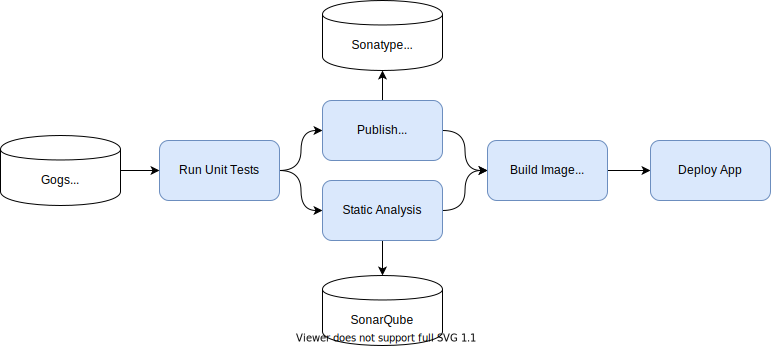
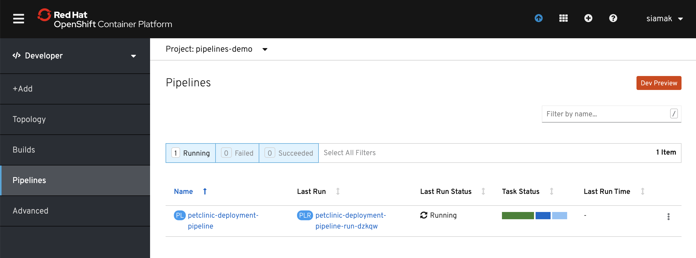
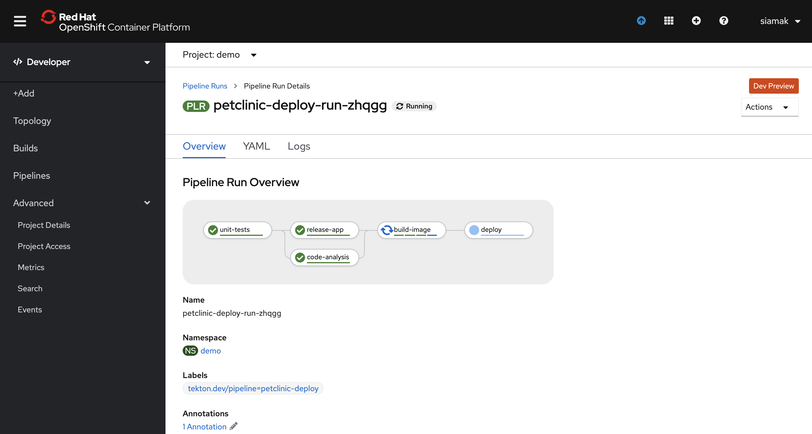

# CI/CD Demo with Tekton Pipelines

This repo is a sample [Tekton](http://www.tekton.dev) pipeline that builds and deploys the [Spring PetClinic](https://github.com/spring-projects/spring-petclinic) sample Spring Boot application on OpenShift. This demo creates:
* 3 namespaces for CI/CD, DEV and STAGE projects
* A sample Tekton pipeline
* Gogs git server (username/password: `gogs`/`gogs`)
* Sonatype Nexus (username/password: `admin`/`admin123`)
* SonarQube (username/password: `admin`/`admin`)
* Report repository for test and project generated reports
* Imports [Spring PetClinic](https://github.com/spring-projects/spring-petclinic) repository into Gogs git server
* Adds a webhook to `spring-petclinic` repository in Gogs to start the Tekton pipeline

<p align="center">
  
</p>

On every push to the `spring-petclinic` git repository on Gogs git server, the following steps are executed within the pipeline:

1. Code is cloned from Gogs and the unit-tests are run
1. Application is packaged as a JAR and pushed to Sonatype Nexus snapshot repository
1. In parallel, the code is analyzed by SonarQube for anti-patterns, code coverage and potential bugs
1. A container image (_spring-petclinic:latest_) is built using the [Source-to-Image](https://github.com/openshift/source-to-image) for Java apps, and pushed to OpenShift internal registry
1. Application image is deployed with a rolling update




# Deploy

1. Get an OpenShift cluster via https://try.openshift.com
1. Install OpenShift Pipelines Operator
1. Download [OpenShift CLI](https://mirror.openshift.com/pub/openshift-v4/clients/ocp/latest/) and [Tekton CLI](https://github.com/tektoncd/cli/releases) 
1. Deploy the demo

    ```
    $ oc new-project demo
    $ git clone https://github.com/siamaksade/tekton-cd-demo 
    $ demo.sh install
    ```

1. Start the deploy pipeline by making a change in the `spring-petclinic` Git repository on Gogs, or run the following:

    ```
    $ demo.sh start
    ```

1. Check pipeline run logs

    ```
    $ tkn pipeline logs petclinic-deploy-dev -f NAMESPACE
    ```




