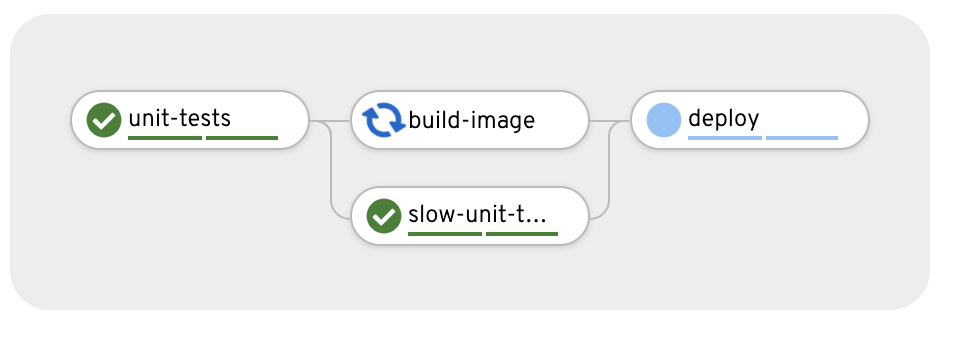

# CI/CD Demo with Tekton Pipelines


1. Get an OpenShift cluster via try.openshift.com 

2. Install OpenShift Pipelines Operator

3. Download [OpenShift CLI](https://mirror.openshift.com/pub/openshift-v4/clients/ocp/latest/), [Tekton CLI](https://github.com/tektoncd/cli/releases) and [Kustomize](https://github.com/kubernetes-sigs/kustomize/releases/tag/kustomize%2Fv3.4.0)

3. Deploy the demo

  ```
  $ oc new-project demo
  $ oc create -f https://raw.githubusercontent.com/siamaksade/tekton-cd-demo/master/install-taskrun.yaml
  ```

  You can check out the install logs using the Tekton CLI `tkn tr logs -f`.


